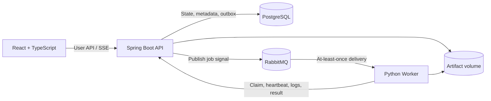

# LabFlow

> A reliable distributed job platform for reproducible scientific computing.

LabFlow is a portfolio project for laboratory teams that need to submit, run, observe, and compare scientific computing jobs. The planned system accepts validated molecular inputs and versioned PySCF configurations, dispatches work to Python workers, streams execution logs, and preserves enough provenance to explain and reproduce every result.

The central engineering problem is reliability rather than raw job volume. LabFlow is designed around RabbitMQ's **at-least-once delivery**: a job may be executed more than once after a failure, but leases, attempt tokens, and a database uniqueness constraint ensure that only one valid final result is accepted.

> [!IMPORTANT]
> LabFlow is currently in the **Engineering baseline stage**. The complete local container topology, initial PostgreSQL migrations, Testcontainers integration test, frontend typecheck, and Worker heartbeat scaffold are operational. Job messaging, task execution, and the reliability workflow described below are still planned.

## Current status

| Area | Status | What exists now |
| --- | --- | --- |
| Repository structure | In progress | Backend, worker, frontend, infrastructure, test, and ADR directories |
| Java backend | In progress | Spring Boot 4.1 application on Java 21 |
| System API | Implemented | `GET /api/system/info` |
| Health monitoring | Implemented | Spring Boot Actuator health and info exposure |
| Automated tests | Initial | Backend tests including a PostgreSQL Testcontainers migration test; frontend typecheck; Worker pytest |
| PostgreSQL / Flyway | Implemented | Containerized PostgreSQL with `app_users` and `projects` migrations |
| RabbitMQ / Outbox | Infrastructure only | RabbitMQ Management container is healthy; backend AMQP and Outbox are not implemented |
| Python worker / PySCF | Scaffolded | Installable package and two named containers emitting heartbeat JSON; no task execution yet |
| React frontend | Scaffolded | Strict TypeScript/Vite application served by non-root Nginx |
| Docker Compose / CI | In progress | Six-service Compose topology is operational; GitHub Actions is not implemented |

## Why LabFlow?

Scientific jobs are long-running and failure-prone. A worker can disappear after accepting a message, a broker can redeliver an event, and a client can retry the same submission. Treating these as normal system behavior leads to several explicit design goals:

- **Idempotent submission** — concurrent requests with the same `Idempotency-Key` create one job.
- **Recoverable execution** — heartbeats and leases allow an abandoned job to be claimed by another worker.
- **Fenced results** — a stale worker cannot overwrite the result of a newer attempt.
- **Reproducibility** — each job records immutable input, configuration, code, image, and runtime metadata.
- **Observable behavior** — job events, attempts, live logs, retry reasons, and recovery time remain inspectable.

LabFlow does **not** claim strict exactly-once execution. Its intended guarantee is:

> Work may run more than once, but only one authorized final result can be committed for a job.

## Target architecture



PostgreSQL is the source of truth for job state. RabbitMQ carries only execution signals. Workers do not write job state directly to the database; they use protected internal APIs so state transitions, authorization, lease checks, and result fencing remain centralized in the backend.

The intended execution flow is:

1. The API creates a job, an idempotency record, and an outbox event in one database transaction.
2. The outbox publisher sends the job ID to RabbitMQ.
3. A worker consumes the message and atomically claims a new job attempt.
4. The worker renews its lease, uploads ordered log chunks, and runs a whitelisted task.
5. The backend accepts the result only when the attempt token is still active.
6. If the lease expires, the old attempt becomes `LOST` and the job is queued for a new attempt.

## Planned reliability model

### Job and attempt separation

A **Job** represents the computation requested by a user. An **Attempt** represents one worker's execution of that job. A worker failure creates another attempt for the same job rather than a duplicate job, preserving both the user's intent and the complete failure history.

### Transactional outbox

Creating a job and recording its pending message will happen in the same PostgreSQL transaction. This prevents a committed `QUEUED` job from being silently lost if RabbitMQ is unavailable between the database write and message publication.

### Lease and fencing token

Each claimed attempt receives a short-lived lease and a unique token. The worker renews the lease with heartbeats. Once the lease expires, late heartbeats, logs, or results from that attempt are rejected as `STALE_ATTEMPT`.

### Unique final result

The planned `job_result` schema has a unique constraint on `job_id`. Combined with transactional token validation, it acts as the final safeguard against duplicate or late result commits.

## Implemented API

### System information

```http
GET /api/system/info
```

Example response:

```json
{
  "service": "labflow-api",
  "version": "0.1.0",
  "status": "UP"
}
```

### Actuator health

```http
GET /actuator/health
```

The Actuator response includes PostgreSQL health. RabbitMQ currently has its own Docker healthcheck and will join backend health when AMQP integration is implemented.

## Run the local stack

### Prerequisites

- Docker Engine or Docker Desktop with Docker Compose

The Compose file includes development defaults. Copy `.env.example` to `.env` first if you want to customize credentials or host ports.

```bash
git clone <https://github.com/xyydcoldcold/LabFlow>
cd LabFlow
docker compose up --build --wait
```

The local services are available at:

- Frontend: `http://localhost:3000`
- Backend API: `http://localhost:8080`
- Backend health: `http://localhost:8080/actuator/health`
- RabbitMQ Management: `http://localhost:15672`
- PostgreSQL: `localhost:5432`

Stop the stack without deleting persistent database or broker volumes:

```bash
docker compose down
```

Run the current checks with:

```bash
cd backend
./gradlew test
cd ../frontend
npm ci
npm run typecheck
cd ../worker
python3 -m pytest
```

## Technology stack

### Implemented

- Java 21
- Spring Boot 4.1
- Spring Web MVC
- Spring Boot Actuator
- Gradle Kotlin DSL
- JUnit 5

### Selected for upcoming stages

- PostgreSQL and Flyway
- RabbitMQ
- Python worker and PySCF
- React and TypeScript
- Docker Compose
- Testcontainers
- GitHub Actions
- Server-Sent Events (SSE)

## Repository layout

```text
LabFlow/
├── backend/                 # Spring Boot API (active development)
├── worker/                  # Python task runner (planned)
├── frontend/                # React client (planned)
├── infra/                   # Broker definitions and operational assets (planned)
├── tests/
│   ├── fault-injection/     # Worker and dependency failure scenarios
│   └── performance/         # Repeatable performance scenarios and results
├── docs/adr/                # Architecture decision records
├── docker-compose.yml       # Placeholder
└── README.md
```

## Roadmap

- [x] Create the monorepo structure
- [x] Initialize the Java 21 / Spring Boot backend
- [x] Add the system information and Actuator health endpoints
- [x] Add an application context smoke test
- [x] Add PostgreSQL, RabbitMQ, service containers, health checks, and persistent volumes
- [x] Create the initial Flyway migrations and Testcontainers integration test
- [ ] Implement authentication, projects, membership roles, inputs, and immutable configurations
- [ ] Implement the job state machine, idempotent submission, and transactional outbox
- [ ] Implement the Python worker, whitelisted task registry, SSE logs, and result storage
- [ ] Implement heartbeats, leases, stale-attempt fencing, retry queues, cancellation, and DLQ handling
- [ ] Build the React workflow for submission, history, attempt inspection, and result comparison
- [ ] Add CI, end-to-end tests, fault injection, and reproducible performance benchmarks

The detailed project plan targets two initial task types: a deterministic `demo.sleep_hash` task for reliability testing and `pyscf.single_point` for a real scientific computing path.

## Planned acceptance tests

The reliability claims will be treated as complete only when they are backed by automated tests and retained evidence:

| Scenario | Required outcome |
| --- | --- |
| 50 concurrent submissions with the same key and body | One job and one idempotency record |
| Same key reused with a different body | `409 IDEMPOTENCY_KEY_REUSED`; no new job |
| RabbitMQ unavailable after database commit | Outbox event remains and is eventually delivered |
| Worker killed during execution | Lease expires, old attempt becomes `LOST`, another worker completes the job |
| Stale worker submits a late result | `409 STALE_ATTEMPT`; accepted result remains unchanged |
| Browser reconnects to the log stream | Missing chunks replay in sequence using `Last-Event-ID` |
| Retry limit is reached | Job becomes `FAILED` and its message enters the DLQ |

Performance targets in the implementation report are goals, not measured results. Throughput, latency, and recovery numbers will be published only after the benchmark environment, raw output, commit, and repeated runs are stored in the repository.

## Scope and non-goals

The MVP focuses on a reliable, explainable execution path for validated task types. It will not:

- execute arbitrary user-provided Python or shell commands;
- act as a notebook environment;
- provide a general workflow DAG engine;
- replace Slurm or another HPC scheduler;
- include billing;
- claim production-grade multi-region or exactly-once execution.

Object storage, multi-instance SSE broadcasting, quotas, fair scheduling, Kubernetes, and Slurm adapters are stretch goals and do not block the core reliability milestone.


## License

No license has been selected yet. Until a license is added, all rights are reserved.
