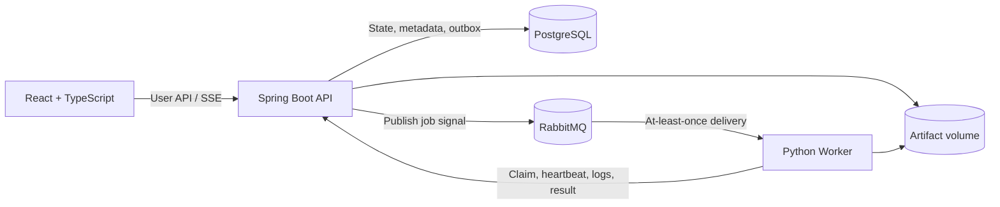

# LabFlow

> A reliable distributed job platform for reproducible scientific computing.

LabFlow is a portfolio project for laboratory teams that need to submit, run, observe, and compare scientific computing jobs. The planned system accepts validated molecular inputs and versioned PySCF configurations, dispatches work to Python workers, streams execution logs, and preserves enough provenance to explain and reproduce every result.

The central engineering problem is reliability rather than raw job volume. LabFlow is designed around RabbitMQ's **at-least-once delivery**: a job may be executed more than once after a failure, but leases, attempt tokens, and a database uniqueness constraint ensure that only one valid final result is accepted.


## Why LabFlow?

Scientific jobs are long-running and failure-prone. A worker can disappear after accepting a message, a broker can redeliver an event, and a client can retry the same submission. Treating these as normal system behavior leads to several explicit design goals:

- **Idempotent submission** — concurrent requests with the same `Idempotency-Key` create one job.
- **Recoverable execution** — heartbeats and leases allow an abandoned job to be claimed by another worker.
- **Fenced results** — a stale worker cannot overwrite the result of a newer attempt.
- **Reproducibility** — each job records immutable input, configuration, code, image, and runtime metadata.
- **Observable behavior** — job events, attempts, live logs, retry reasons, and recovery time remain inspectable.

LabFlow does **not** claim strict exactly-once execution. Its intended guarantee is:

> Work may run more than once, but only one authorized final result can be committed for a job.

## Target architecture



PostgreSQL is the source of truth for job state. RabbitMQ carries only execution signals. Workers do not write job state directly to the database; they use protected internal APIs so state transitions, authorization, lease checks, and result fencing remain centralized in the backend.

The intended execution flow is:

1. The API creates a job, an idempotency record, and an outbox event in one database transaction.
2. The outbox publisher sends the job ID to RabbitMQ.
3. A worker consumes the message and atomically claims a new job attempt.
4. The worker renews its lease, uploads ordered log chunks, and runs a whitelisted task.
5. The backend accepts the result only when the attempt token is still active.
6. If the lease expires, the old attempt becomes `LOST` and the job is queued for a new attempt.

## Planned reliability model

### Job and attempt separation

A **Job** represents the computation requested by a user. An **Attempt** represents one worker's execution of that job. A worker failure creates another attempt for the same job rather than a duplicate job, preserving both the user's intent and the complete failure history.

### Transactional outbox

Creating a job and recording its pending message will happen in the same PostgreSQL transaction. This prevents a committed `QUEUED` job from being silently lost if RabbitMQ is unavailable between the database write and message publication.

### Lease and fencing token

Each claimed attempt receives a short-lived lease and a unique token. The worker renews the lease with heartbeats. Once the lease expires, late heartbeats, logs, or results from that attempt are rejected as `STALE_ATTEMPT`.

### Unique final result

The planned `job_result` schema has a unique constraint on `job_id`. Combined with transactional token validation, it acts as the final safeguard against duplicate or late result commits.

## Implemented API

### Authentication

Registering creates the account and returns a one-hour Bearer token:

```http
POST /api/auth/register
Content-Type: application/json

{
  "email": "scientist@example.com",
  "password": "strong-password",
  "displayName": "Ada Lovelace"
}
```

Log in with the same credentials:

```http
POST /api/auth/login
Content-Type: application/json

{
  "email": "scientist@example.com",
  "password": "strong-password"
}
```

Validate a token and load the current account:

```http
GET /api/auth/me
Authorization: Bearer <access-token>
```

Passwords are stored only as BCrypt hashes. Email addresses are trimmed and normalized to lowercase. Missing, expired, malformed, or incorrectly signed tokens receive the same non-leaking JSON `401` structure; authenticated authorization failures use the corresponding JSON `403` structure.

For non-local environments, provide a random `AUTH_JWT_SECRET` containing at least 32 UTF-8 bytes. `AUTH_JWT_ISSUER` and the ISO-8601 duration `AUTH_JWT_TTL` are also configurable.

### System information

```http
GET /api/system/info
```

Example response:

```json
{
  "service": "labflow-api",
  "version": "0.1.0",
  "status": "UP"
}
```

### Actuator health

```http
GET /actuator/health
```

The Actuator response includes PostgreSQL health. RabbitMQ currently has its own Docker healthcheck and will join backend health when AMQP integration is implemented.

## Run the local stack

### Prerequisites

- Docker Engine or Docker Desktop with Docker Compose

The Compose file includes development defaults. Copy `.env.example` to `.env` first if you want to customize credentials or host ports.

```bash
git clone <https://github.com/xyydcoldcold/LabFlow>
cd LabFlow
docker compose up --build --wait
```

The local services are available at:

- Frontend: `http://localhost:3000`
- Backend API: `http://localhost:8080`
- Backend health: `http://localhost:8080/actuator/health`
- RabbitMQ Management: `http://localhost:15672`
- PostgreSQL: `localhost:5432`

Stop the stack without deleting persistent database or broker volumes:

```bash
docker compose down
```

Run the current checks with:

```bash
cd backend
./gradlew test
cd ../frontend
npm ci
npm run typecheck
cd ../worker
python3 -m pytest
```

## Technology stack

### Implemented

- Java 21
- Spring Boot 4.1
- Spring Web MVC
- Spring Security
- OAuth2 Resource Server JWT validation
- Spring Boot Actuator
- Gradle Kotlin DSL
- JUnit 5
- PostgreSQL 17 and Flyway
- RabbitMQ 4 Management (local infrastructure)
- Python 3.12+ worker package and pytest
- React 19, TypeScript, and Vite
- Docker Compose
- Testcontainers
- GitHub Actions

### Selected for upcoming stages

- Project-level authorization
- Spring AMQP and the transactional Outbox
- PySCF task execution
- Server-Sent Events (SSE)

## Repository layout

```text
LabFlow/
├── backend/                 # Spring Boot API and Flyway migrations
├── worker/                  # Python worker heartbeat scaffold
├── frontend/                # React/Vite scaffold served by Nginx
├── infra/                   # Reserved for broker and operational assets
├── tests/
│   ├── fault-injection/     # Worker and dependency failure scenarios
│   └── performance/         # Repeatable performance scenarios and results
├── docs/adr/                # Architecture decision records
├── .github/workflows/ci.yml # Backend, frontend, worker, and image checks
├── docker-compose.yml       # Six-service local development stack
└── README.md
```


## License

No license has been selected yet. Until a license is added, all rights are reserved.
