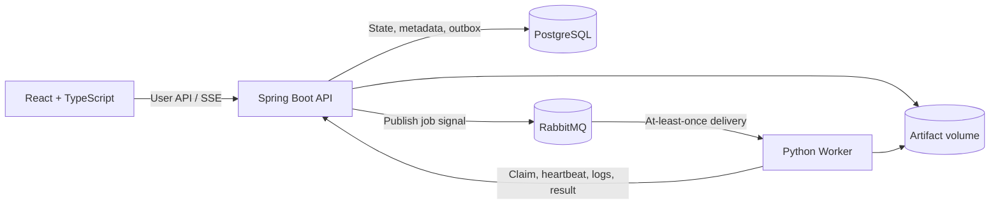

# LabFlow

> A reliable distributed job platform for reproducible scientific computing.


LabFlow is a portfolio project for laboratory teams that need to submit, run, observe, and compare scientific computing jobs. The system accepts validated molecular inputs and versioned PySCF configurations, dispatches work to Python workers, streams execution logs, and preserves enough provenance to explain and reproduce every result.

The central engineering problem is reliability rather than raw job volume. LabFlow is designed around RabbitMQ's **at-least-once delivery**: a job may be executed more than once after a failure, but leases, attempt tokens, and a database uniqueness constraint ensure that only one valid final result is accepted.


## Why LabFlow?

Scientific jobs are long-running and failure-prone. A worker can disappear after accepting a message, a broker can redeliver an event, and a client can retry the same submission. Treating these as normal system behavior leads to several explicit design goals:

- **Idempotent submission** — concurrent requests with the same `Idempotency-Key` create one job.
- **Recoverable execution** — heartbeats and leases allow an abandoned job to be claimed by another worker.
- **Fenced results** — a stale worker cannot overwrite the result of a newer attempt.
- **Reproducibility** — each job records immutable input, configuration, code, image, and runtime metadata.
- **Observable behavior** — job events, attempts, live logs, retry reasons, and recovery time remain inspectable.

LabFlow does **not** claim strict exactly-once execution. Its intended guarantee is:

> Work may run more than once, but only one authorized final result can be committed for a job.

## Target architecture


```mermaid
flowchart LR
    UI[React + TypeScript] -->|User API / SSE| API[Spring Boot API]
    API -->|State, metadata, outbox| DB[(PostgreSQL)]
    API -->|Publish job signal| MQ[(RabbitMQ)]
    MQ -->|At-least-once delivery| WORKER[Python Worker]
    WORKER -->|Claim, heartbeat, logs, result| API
    API --> ARTIFACTS[(Artifact volume)]
    WORKER --> ARTIFACTS
```

PostgreSQL is the source of truth for job state. RabbitMQ carries only execution signals. Workers do not write job state directly to the database; they use protected internal APIs so state transitions, authorization, lease checks, and result fencing remain centralized in the backend.

The intended execution flow is:

1. The API creates a job, an idempotency record, and an outbox event in one database transaction.
2. The outbox publisher sends the job ID to RabbitMQ.
3. A worker consumes the message and atomically claims a new job attempt.
4. The worker uploads ordered log chunks and runs a whitelisted task in an isolated subprocess.
5. The backend accepts the result only when the attempt token is still active.
6. A scheduled RecoveryReaper marks expired attempts `LOST` and requeues eligible jobs through a new Outbox event. Jobs that exhaust `maxAttempts` become `FAILED`.

## Reliability model

### Job and attempt separation

A **Job** represents the computation requested by a user. An **Attempt** represents one worker's execution of that job. A worker failure creates another attempt for the same job rather than a duplicate job, preserving both the user's intent and the complete failure history.

### Transactional outbox

Creating a job and recording its pending message happens in the same PostgreSQL transaction. This prevents a committed `QUEUED` job from being silently lost if RabbitMQ is unavailable between the database write and message publication. A scheduled publisher claims available rows with `FOR UPDATE SKIP LOCKED`, sends persistent messages, waits for correlated publisher confirms, and only then records `published_at`. Failed sends remain unpublished and use capped exponential backoff. A crash after broker confirmation but before the database update can publish a duplicate, which is intentional under the system's at-least-once contract.

The version 1 broker message is deliberately small:

```json
{"jobId": 42, "eventId": 87, "schemaVersion": 1}
```

RabbitMQ declares a durable direct exchange, a durable quorum work queue, 15/60/300-second TTL retry queues, and a durable DLQ. Workers consume manually with prefetch one, claim jobs through the protected backend API, and acknowledge after the backend confirms a committed result, cancellation, or attempt failure with a durable retry decision.

### Lease and fencing token

Each claimed attempt receives a lease and a unique fencing token. Every new heartbeat, log, and terminal result write must present that token and an unexpired lease; writes from an expired or non-active attempt are rejected as `STALE_ATTEMPT`. Retries of an already committed terminal outcome remain idempotent for its original token. The worker renews active leases at most every five seconds (sooner for shorter leases), and updates worker liveness while idle. Renewal uses the backend Clock and rejects expired leases. The executor services RabbitMQ traffic during calculation and kills the task process group if renewal cannot be confirmed.

### Expired-attempt recovery

A RecoveryReaper scans every five seconds in bounded batches, locks expired attempts and jobs with `SKIP LOCKED`, and uses a job-version guard. It atomically marks the attempt `LOST`, advances the job version, records recovery history, and writes a new Outbox event when another attempt is allowed. Recovery at the attempt limit marks the job `FAILED` and records a durable DLQ signal. If cancellation is pending when the lease expires, recovery marks the attempt `LOST` and job `CANCELLED` without a retry message.

### Cancellation

Authenticated contributors can cancel their own jobs; project owners and maintainers can cancel any project job. QUEUED jobs cancel immediately. RUNNING jobs keep a pending request until the worker stops the subprocess and confirms cancellation, or the lease expires and recovery finalizes it. A committed cancellation request blocks later result/failure commits; a completed job stays final.

### Typed retries and failure replay

Transient task/network/log failures and expired worker leases retry through the 15/60/300-second TTL queues, with up to one second of publication jitter. The backend guards `next_attempt_at` so duplicate delivery cannot bypass the delay. New jobs have four total attempts; existing jobs keep their stored budget. Invalid input/configuration, non-converged SCF, resource limits, timeouts, and unknown errors fail without automatic retry. Exhausted transient failures produce a durable DLQ signal through the same transactional Outbox.

The job detail view shows attempt failures. Project owners and maintainers can use **Replay as a new job**, backed by `POST /api/jobs/{id}/replay` with an `Idempotency-Key`. Replay preserves the failed job and its history, creates a fresh job with the same immutable input/configuration references, and records its source ID. Repeated requests with the same key create one replay job.

### Unique final result

The `job_results` table has a primary key on `job_id` and a unique attempt constraint. Combined with transactional token validation, it is the final safeguard against duplicate or late result commits.

## Implemented API

### Authentication

Registering creates the account and returns a one-hour Bearer token:

```http
POST /api/auth/register
Content-Type: application/json

{
  "email": "scientist@example.com",
  "password": "strong-password",
  "displayName": "Ada Lovelace"
}
```

Log in with the same credentials:

```http
POST /api/auth/login
Content-Type: application/json

{
  "email": "scientist@example.com",
  "password": "strong-password"
}
```

Validate a token and load the current account:

```http
GET /api/auth/me
Authorization: Bearer <access-token>
```

Passwords are stored only as BCrypt hashes. Email addresses are trimmed and normalized to lowercase. Missing, expired, malformed, or incorrectly signed tokens receive the same non-leaking JSON `401` structure; authenticated authorization failures use the corresponding JSON `403` structure.

For non-local environments, provide a random `AUTH_JWT_SECRET` containing at least 32 UTF-8 bytes. `AUTH_JWT_ISSUER` and the ISO-8601 duration `AUTH_JWT_TTL` are also configurable.

### System information

```http
GET /api/system/info
```

Example response:

```json
{
  "service": "labflow-api",
  "version": "0.1.0",
  "status": "UP"
}
```

### Actuator health

```http
GET /actuator/health
```

The Actuator response includes PostgreSQL and RabbitMQ health. RabbitMQ also has its own Docker healthcheck.

### Versioned experiment configurations

Project contributors create an immutable configuration version with:

```http
POST /api/projects/{projectId}/configs
Authorization: Bearer <access-token>
Content-Type: application/json

{
  "name": "Baseline",
  "spec": {
    "schemaVersion": 1,
    "taskType": "pyscf.single_point",
    "method": "RHF",
    "basis": "sto-3g",
    "charge": 0,
    "spin": 0,
    "maxMemoryMb": 1024,
    "timeoutSeconds": 300
  }
}
```

Posting the same name again creates the next version; it never updates an existing row. Project members can inspect every version with `GET /api/projects/{projectId}/configs` or fetch one through `GET /api/projects/{projectId}/configs/{configId}`. The version 1 contract is published at `backend/src/main/resources/schemas/experiment-config-v1.schema.json`.

### Idempotent job submission

Project owners, maintainers, and members can submit a job using an input and configuration from the same project:

```http
POST /api/jobs
Authorization: Bearer <access-token>
Idempotency-Key: <client-generated-unique-key>
Content-Type: application/json

{
  "projectId": 1,
  "molecularInputId": 2,
  "experimentConfigId": 3
}
```

The first request creates a `QUEUED` job, an idempotency record, a pending outbox event, and a job audit event in one transaction. The response is `201 Created` with `Location: /api/jobs/{id}`. Reusing the key in the same user/project scope with the same semantic request returns the original `201` response; reusing it with different IDs returns `409 IDEMPOTENCY_KEY_REUSED`. JSON property order and whitespace do not affect the request hash, and unsupported fields are rejected. A job submission stores an immutable snapshot of the input and configuration. The outbox publisher reliably delivers its execution signal to RabbitMQ, where a registered worker claims and executes it.

### Worker execution and observation

Workers authenticate to `/internal/**` with a dedicated service token, register their image digest and explicit capabilities, then atomically claim a fenced job attempt. They never execute broker-provided commands: the broker carries only IDs, and task dispatch is limited to the `demo.sleep_hash` and `pyscf.single_point` registry entries. Tasks run without a shell in a separate process group with a reduced environment, a wall-clock timeout, CPU limits, and a Linux address-space limit.

`pyscf.single_point` validates the immutable input checksum, parses XYZ coordinates, executes the configured SCF calculation, and records energy, convergence, timing, PySCF/Python/platform versions, image identity, spec hash, and artifact metadata. Ordered stdout/stderr/system chunks are persisted idempotently and exposed through both the job detail response and resumable SSE:

```http
GET /api/projects/{projectId}/jobs
GET /api/jobs/{jobId}
GET /api/jobs/{jobId}/events
Authorization: Bearer <access-token>
Last-Event-ID: <last-seen-log-id>
```

Set `WORKER_SERVICE_TOKEN` to the same random value of at least 32 bytes for the backend and workers outside local development.

### Web workspace

The React workspace provides registration and login, visible-project selection, owner-only membership management, validated XYZ upload, immutable configuration creation, and job submission using a selected input and configuration version. The job view shows status, attempt, live SSE logs, result energy, failures, and a reproducibility manifest. Log connections authenticate with the Bearer token and reconnect using `Last-Event-ID`; status and result metadata refresh every two seconds. Submission retries retain the same idempotency key after an uncertain network response. Controls reflect the current project role, while the backend remains the authorization boundary.

For frontend development, start the backend on port `8080`, then run:

```bash
cd frontend
npm run dev
```

Vite proxies `/api` to the backend. The production Nginx image uses the same paths inside Docker Compose.

## Run the local stack

For a single-VM cloud staging deployment with HTTPS, private infrastructure, server-created accounts, and deployment backups, follow [the cloud deployment runbook](docs/CLOUD_DEPLOYMENT.md). Worker-loss recovery is implemented; cloud recovery acceptance still needs to be verified.

### Prerequisites

- Docker Engine or Docker Desktop with Docker Compose

The Compose file includes development defaults. Copy `.env.example` to `.env` first if you want to customize credentials or host ports.

```bash
git clone <https://github.com/xyydcoldcold/LabFlow>
cd LabFlow
docker compose up --build --wait
```

The local services are available at:

- Frontend: `http://localhost:3000`
- Backend API: `http://localhost:8080`
- Backend health: `http://localhost:8080/actuator/health`
- RabbitMQ Management: `http://localhost:15672`
- PostgreSQL: `localhost:5432`

Stop the stack without deleting persistent database or broker volumes:

```bash
docker compose down
```

Run the current checks with:

```bash
cd backend
./gradlew test
cd ../frontend
npm ci
npm run typecheck
npm test
npm run build
cd ../worker
python3 -m pytest
```

With the Compose stack running, run the real browser acceptance flow:

```bash
cd frontend
npx playwright install chromium
npm run test:e2e
```

For a manual run, upload [`examples/h2.xyz`](examples/h2.xyz), create an RHF/`sto-3g` configuration with charge 0 and spin 0, then select both in Jobs, click **Review submission**, and confirm with **Submit job**. The expected converged energy is approximately **−1.1167593074 Hartree**.

## Frontend workflow and demo

Use **Explore demo** on the sign-in page, or open `http://localhost:3000/?demo=1`. The demo runs in the browser with clearly labeled fictional, read-only data. It needs no API, does not submit calculations, and leaves any existing login token unchanged. Inspect Job #1 to see a lost attempt followed by a takeover; select Jobs #1 and #2 to compare their configurations and sample results. Exit demo to return to the real workspace.

In a real workspace, the two-step wizard displays the project, input, immutable configuration version, and idempotency key before submission. Retries after a lost response reuse that key. The job list preserves status, job-ID search, and page in the URL; details show recorded transitions, attempts, Workers, logs, execution environment, and the accepted result. Authorized contributors can request cancellation; running jobs remain running until the worker acknowledges the request. Select 2–5 successful jobs to compare saved method, basis, input hash, energy, wall time, and image metadata.

Run the browser smoke tests without Docker or a backend:

```bash
npm --prefix frontend ci
cd frontend
npx playwright install chromium
npm run test:ui
```

The smoke suite covers the demo, failed-load recovery, keyboard dialog navigation, SSE cursor resume and duplicate suppression, submission retries, filtering/pagination, cancellation UI, and result comparison. CI runs this suite separately from `npm run test:e2e`, which needs the real Compose stack. Frontend builds and unit tests run independently.

Filtering and pagination currently operate on all downloaded project job summaries. The recorded image field can contain a local image tag; an immutable digest is shown only when supplied by the deployment. Demo data is illustrative and is not test or benchmark evidence.

## Technology stack

### Implemented

- Java 21
- Spring Boot 4.1
- Spring Web MVC
- Spring Security
- OAuth2 Resource Server JWT validation
- Spring Boot Actuator
- Gradle Kotlin DSL
- JUnit 5
- PostgreSQL 17 and Flyway
- RabbitMQ 4, Spring AMQP, publisher confirms, retry queues, and DLQ topology
- Python 3.12+ worker package, PySCF, Pika, and pytest
- Server-Sent Events (SSE) log streaming
- React 19, TypeScript, and Vite
- Docker Compose
- Testcontainers
- GitHub Actions

### Selected for upcoming stages

- Lease renewal and abandoned-attempt recovery
- Fault injection and retry orchestration

## Repository layout

```text
LabFlow/
├── backend/                 # Spring Boot API and Flyway migrations
├── worker/                  # Python RabbitMQ consumer and scientific task runtime
├── frontend/                # React workspace, SSE client, and browser acceptance tests
├── infra/                   # Reserved for broker and operational assets
├── tests/
│   ├── fault-injection/     # Worker and dependency failure scenarios
│   └── performance/         # Repeatable performance scenarios and results
├── docs/adr/                # Architecture decision records
├── .github/workflows/ci.yml # Backend, frontend, worker, and image checks
├── docker-compose.yml       # Six-service local development stack
└── README.md
```


## License

No license has been selected yet. Until a license is added, all rights are reserved.

## Worker-crash acceptance

The isolated harness uses its own Compose project and volumes and only binds test HTTP ports to localhost. Build the standard local backend/worker images first, then build the latest acceptance overlays:

```bash
backend/gradlew -p backend bootJar
docker compose build backend worker-a
docker compose -p labflow-w5-local -f tests/fault-injection/compose.yml build
docker compose -p labflow-w5-local -f tests/fault-injection/compose.yml up -d --wait postgres rabbitmq backend frontend
python3 tests/fault-injection/week5.py --project labflow-w5-local --rounds 20
```

Each round SIGKILLs worker-a, starts worker-b, checks LOST + SUCCEEDED history, rejects old-token writes, and verifies exactly one result row. The JSON report at `test-results/week5-crash.json` stays local and records every run plus median/p95 timings and PASS/FAIL gates. This test stack uses a five-second lease, one-second recovery scan, and the actual 15/60/300-second retry TTLs; these timings do not characterize the default 30-second lease or a cloud VM.

For browser acceptance after the crash suite:

```bash
docker compose -p labflow-w5-local -f tests/fault-injection/compose.yml up -d --no-deps worker-b
cd frontend
LABFLOW_E2E_URL=http://127.0.0.1:13085 npm run test:e2e -- week5-replay.spec.ts
```

Stop the dedicated test stack from the repository root when finished:

```bash
docker compose -p labflow-w5-local -f tests/fault-injection/compose.yml down
```

Volumes remain available for evidence review. Public deployment, VM recovery, backup restoration, and scientific-throughput benchmarking require their own acceptance runs.
